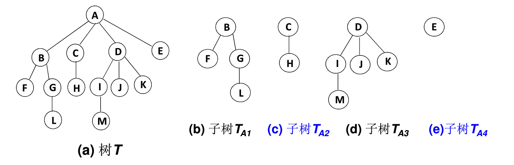
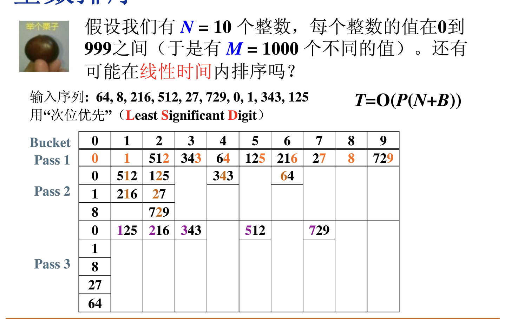

## 数据结构与算法

### 基本概念
#### 什么是数据结构
- 数据结构
1.数据对象在计算机中的组织方式：逻辑结构、物理存储结构
2.数据对象必定与一系列加在其上的操作相关联
3.完成这些操作所用的方法就是算法
- 抽象数据类型
1.数据类型：数据对象集、数据集合相关联的操作集
2.抽象：描述数据类型的方法不依赖于其具体实现
即只描述数据对象集合相关操作集‘是什么’，并不涉及‘如何做到’的问题
#### 什么是算法
- 算法定义
1.一个有限指令集
2.接受一些输入（有些情况下不需要输入）
3.产生输出
4.一定在有限步骤之后终止
5.每一条指令必须有充分明确的目标，在计算机能处理范围之内且描述不能依赖于任何一种计算机语言以及具体的实现
- 好的算法
1.空间复杂度S(n)：根据算法写成的程序在执行时占用存储单元的长度
2.时间复杂度T(n)：根据算法写成的程序在执行时耗费时间的长度
- 复杂度
1.T1(n)+T2(n)=max(O(f1(n)),O(f2(n)))
2.T1(n)×T2(n)=O(f1(n)×f2(n))
3.for循环的复杂度等于循环次数乘以循环体复杂度
4.if语句复杂度取决于if的条件判断复杂度和两个分支部分的复杂度，取三者最大的复杂度
#### 应用实例：最大子列和
- 算法1：
```python
def MaxSubseqSum1(a,N):
  #a是给定整数序列，N是序列长度
  MaxSum=0
  for i in range(N):
    for j in range(i,N):
      ThisSum=0
      for k in range(i,j+1):
        ThisSum+=a[k]
      if ThisSum>MaxSum:
        MaxSum=ThisSum
  return MaxSum
```
复杂度T(N)=O(N^3)
- 算法2
```python
def MaxSubseqSum2(a,N):
  MaxSum=0
  for i in range(N):
    ThisSum=0
    for j in range(i,N):
      ThisSum+=a[j]
      if ThisSum>MaxSum:
        MaxSum=ThisSum
  return MaxSum
```
复杂度T(N)=O(N^2)
- 算法3 MapReduce
迭代拆分成两部分，算出左半部分最大子列和，右半部分最大子列和和交叉部分最大子列和，取最大值
复杂度T(N)=O(NlogN)
- 算法4 在线处理
```python
def MaxSubseqSum3(a,N):
  MaxSum=0
  ThisSum=0
  for i in range(N):
    ThisSum+=a[i]#向右累加
    if ThisSum>MaxSum:
      MaxSum=ThisSum#发现更大和更新
    elif ThisSum<0:
      continue#子列和为负则抛弃
  return MaxSum    
```
复杂度T(N)=O(N)

### 线性结构
#### 线性表及其实现
- 什么是线性表
由同类型数据元素构成有序序列的线性结构：
  表中元素个数称为线性表的长度
  线性表中没有元素时，称为空表
  表起始位置称为表头，结束位置称为表尾
- 线性表的抽象数据类型描述
类型名称：线性表
数据对象集：n个元素构成的有序序列
操作集：整数i表示位置，元素X∈ElementType，基本操作有初始化、删除指定位序元素、返回长度等
- 线性表的顺序存储实现
利用数组的连续存储空间顺序存放线性表的各元素
- 线性表的链式存储实现
不要求逻辑上相邻的两个元素物理上也相邻，通过‘链’建立起数据元素之间的逻辑关系
- 广义表
线性表的推广
对于线性表而言，n个元素都是基本的单元素
广义表中，这些元素不仅可以是单元素也可以是另一个广义表

- 多重链表：链表中的节点可能同时隶属多个链
多重链表中结点的指针域会有多个


#### 堆栈
- 什么是堆栈
具有一定操作约束的线性表（只在一端做插入和删除）
插入数据：入栈Push
删除数据：出栈Pop
后入先出（Last In First Out）
- 堆栈的抽象数据类型描述
类型名称：堆栈
数据对象集：一个有0或者多个元素的有穷线性表
操作集：生成空堆栈、出栈、入栈等
- 堆栈的顺序存储实现
堆栈的顺序存储通常由一个一维数组和一个记录栈顶元素位置的变量组成
- 堆栈的链式存储实现
堆栈的链式存储结构实际上就是一个单链表，叫做链栈，插入和删除才做只能在链栈的栈顶进行
- 堆栈的应用
表达式求值、函数调用及递归实现、深度优化搜索、回溯算法

#### 队列
- 什么是队列
具有一定操作约束的线性表：只能在一端插入，另一端删除
插入数据：入队列
删除数据：出队列
先入先出（FIFO）
- 队列的抽象数据类型
类型名称：队列
数据对象集：一个有0个或多个元素的有穷线性表
操作集：删除数据、插入数据
- 队列的顺序存储实现
队列的顺序存储实现通常由一个一维数组和一个记录队列头元素位置的变量front以及一个记录队列尾元素位置的变量rear组成
顺环队列
- 队列的链式存储实现
链式存储可以由一个单链表实现，插入在链表尾，删除在链表头操作

#### 应用：多项式加法运算
- 采用不带头结点的单向链表，按照指数递减的顺序排列各项

### 树（上）

#### 树与树的表示
- 树的定义
树：n个结点构成的有限集合，当n=0时，称为空树
对于任意非空树，具备以下性质：
  数中有一个称为‘根（root）’的特殊结点，用r表示
  其余结点可分为m个互不相交的有限集T1,T2,...,Tm，其中每个集合本身又是一棵树，称为原来树的‘子树（SubTree）’

- 树的基本术语
结点的度：结点的子树个数
树的度：树的所有结点中最大的度数
叶结点：度为0的结点
父结点：有子树的结点是其子树的根结点的父结点
子结点、兄弟结点定义类似父结点
路径和路径长度：从结点n1到nk的路径为一个结点序列，路径所包含边的个数为路径的长度
祖先结点：沿树根到某一结点路径上所有结点都是这个结点的祖先结点
子孙结点定义类似祖先结点
结点的层次：规定根结点在1层，其他任一结点的层数是其父结点的层数加1
树的深度：树中所有结点中的最大层次是这棵树的深度


#### 二叉树及存储结构
- 二叉树的定义
一个有穷的的结点集合，这个集合可以为空，若不为空，则它由根结点和称其为左子树和右子树的两个不相交的二叉树组成
- 特殊二叉树


- 二叉树的性质
对任何非空二叉树T，若n0表示叶结点的个数，n2是度为2的非叶结点的个数，则n0=n2+1
- 二叉树的抽象数据类型定义
数据类型：二叉树
数据对象集：一个有穷的结点集合
操作集：判断是否非空，遍历树，创建新的二叉树
- 二叉树的存储结构
顺序存储结构


链表存储


#### 二叉树的遍历
- 二叉树的遍历
先序遍历：根结点-左子树-右子树
中序遍历：左子树-根结点-右子树
后序遍历：左子树-右子树-根结点
- 二叉树的非递归遍历
堆栈
- 层序遍历：二维结构的线性化
队列实现：遍历从根结点开始，将根结点入队，然后执行循环：结点出队、访问该结点、其左右儿子入列

### 树（中）

#### 二叉搜索树
- 什么是二叉搜索树
二叉搜索树（二叉排序树、二叉查找树）：
  满足非空左子树的所有键值小于其根结点的键值，
  非空右子树的所有键值大于其根结点的键值，
  左右子树都是二叉搜索树
- 二叉树的查找操作
树为空，返回NULL
和根结点比较，小于根结点，到左子树，大于在右子树，否则返回根结点
- 查找最大和最小元素
最大在最右分支的端结点上，最小在最左分支的端结点上
- 二叉树的插入和删除
插入要先找到位置同FIND
删除分三种情况：
  删除叶结点，直接删除，父结点指针置为NULL
  删除只有一个孩子的结点：将其父结点指针指向其子结点
  删除有两个孩子的结点：用右子树的最小元素或者左子树的最大元素替代被删除结点

#### 平衡二叉树
- 什么是平衡二叉树（AVL树）
空树或任一结点左右子树高度差的绝对值不超过1
- AVL树的最小结点数
设nh为高度是h的AVL树的最小结点数，则N(h)=N(h-1)+N(h-2)+1
- 平衡二叉树的调整
RR旋转、LL旋转、RL旋转和LR旋转

### 树（下）

#### 堆
- 什么是堆
优先队列：特殊的队列，取出元素的顺序是依照元素的优先权大小，而不是元素进入队列的相互顺序
- 堆的抽象数据类型描述
类型名称：最大堆
数据对象集：完全二叉树，每个结点的元素值不小于其子结点的元素值
操作集：创建、删除、插入、判断等

#### 哈夫曼树和哈夫曼编码
- 哈夫曼树的定义
带权路径长度：设二叉树有n个叶子结点，每个叶子结点带有权值Wk，从根结点到每个叶子结点的长度为lk，则每个叶子结点的
带权路径长度之和（WPL）
最优二叉树或哈夫曼树：WPL最小的二叉树

#### 集合及运算
- 集合的表示
集合运算：交、并、补、差，判定
- 采用数组存储形式
- 集合运算
查找某个元素所在的集合（用根结点表示）
集合的并运算

### 图（上）

#### 什么是图
- 什么是图
表示‘多对多’关系
包含一组顶点和一组边（不考虑重边和自向边）
- 图的抽象数据类型定义
类型名称：图
数据对象集：一个非空的有限顶点集合和一个有限边集合
操作集：建立、删除、插入等
- 程序中表示一个图
邻接矩阵

邻接表


#### 图的遍历
- 深度优先搜索
- 广度优先搜索
- 连通图
连通：如果从V到W存在一条路径，则称V和W是连通的
路径：V和W的路径是一系列顶点的集合，其中任一对相邻的顶点间都有图的边
回路：起点等于终点的路径
连通图：图中任意两顶点均连通
连通分量：无向图的极大连通子图
强连通：有向图中顶点V和W之间存在双向路径，则称V和W是强连通
强连通图和强连通分量

### 图（中）

#### 最短路径问题
- 最短路径问题的抽象
网络中，求两个不同顶点之间的所有路径中，边权值之和最小的那一条路径
- 无权图的单源最短路算法
按照非递减的顺序找出各个顶点的最短路
- 有权图的单源最短路算法
Dijkstra算法：
  令S={源点s+已经确定了最短路径的顶点Vi}
  对任一未收录的顶点v，定义dist[V]为s到v的最短路径长度，但该路径仅经过S中的顶点
  若路径是按照非递减顺序生成的，则真正的最短路径必须只经过S中的顶点，每次从未收录的顶点中选一个dist最小的收录
- 多源最短路算法
Floyd算法：


### 图（下）

#### 最小生成树
- 什么是最小生成树
是一棵树，无回路，V个顶点有V-1条边
是生成树，包含全部顶点，V-1条边都在图里
边的权重和最小
- Prim算法
- Kruskal算法

#### 拓扑排序
- 拓扑排序
拓扑序：如果图中从V到W有一条有向路径，则V一定排在W之前，满足此条件的顶点序列称为一个拓扑排序
AOV如果有合理的拓扑序，则必定是有向无环图
- 关键路径问题
AOE网络

关键路径


### 排序（上）

#### 简单排序
- 冒泡排序

- 插入排序

- 逆序对：对于下标i>j，如果A[i]<A[j]，则称(i,j)是一对逆序对
  交换两个相邻元素消去一对逆序对
  T(N,I)=O(N+I)
- 任意N个不同元素组成的序列平均有N(N-1)/4对逆序对
  任何仅以交换相邻元素来排序的算法，其平均时间复杂度为Ω(N2)

#### 希尔排序
- 希尔排序


- 增量序列


#### 堆排序


#### 归并排序
- 有序子列的归并

- 递归算法


- 非递归算法


### 排序（下）

#### 快速排序
- 算法概述
随机选取一个数，作为主元，将这些数划分为两个部分，小于主元的是A部分，大于主元的B部分，然后递归的处理A和B

- 选取主元
取头、中和尾的中位数作为主元

- 数据量
小规模数据适合用简单排序，大规模的数据适合快速排序
- 算法


#### 表排序
- 算法概述：简介排序
比较换物理位置，仅仅对指针排序

- 物理排序
N个数字的排列由若干个独立的环组成
- 复杂度分析


#### 基数排序
- 桶排序
将N个数的M种取值设置成M个桶，分别扫描N个数放入到M个桶中

- 基数排序
次位优先（LSD）

主位优先：多关键字排序（MSD）


#### 排序算法比较

