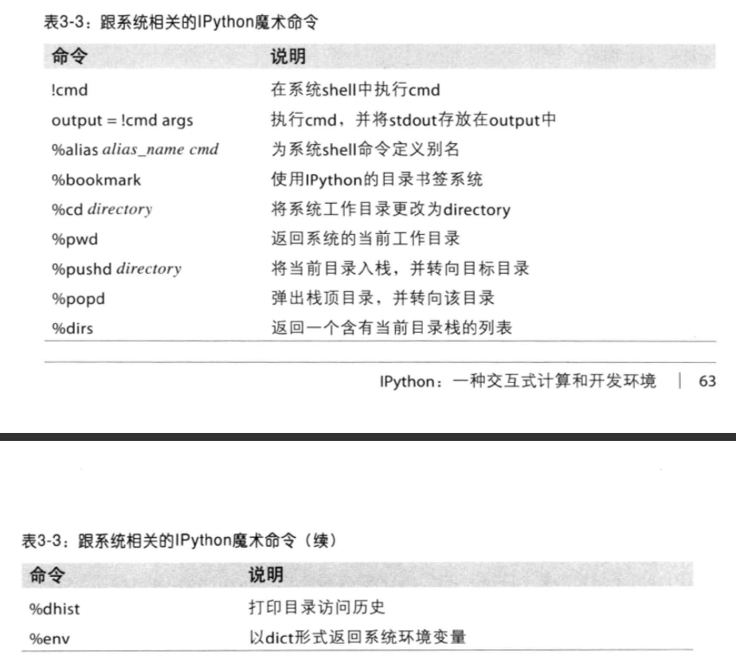
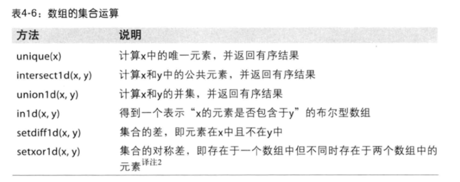

# 利用python进行数据分析

- 将IPython这个交互式shell作为首要开发环境
- 学习NumPy的基础和高级知识
- 从pandas库的数据分析工具开始
- 利用高性能工具对数据进行加载、清理、转换、合并以及重塑
- 利用matplotlib创建散点图以及静态或交互式的可视化结果
- 利用pandas的groupby功能对数据进行切片、切块和汇总操作
- 处理各种的时间序列数据
- 通过详细案例学习如何解决Web分析、社会科学、金融学以及经济学等领域的问题

## 第一章 准备工作

### 主要内容
1. 利用Python进行数据控制、处理、整理、分析等方面的具体细节和基本要求，同时，也是利用python进行科
学计算的实用指南（专门针对数据密集型应用）。重点介绍了用于高效解决各种数据分析问题的Python语言和库
2. 数据：主要指结构化数据，包括但不仅限于
- 多维数组（矩阵）
- 表格型数据
- 通过关键列相互联系的多个表
- 间隔平均或不平均的时间序列

### 为什么利用Python进行数据分析
1. 把Python当做粘合剂：能够轻松地集成C、C++以及Fortran代码
2. 解决“两种语言”问题
3. Python局限性：作为一种解释性编程语言，代码运行要比编译型语言慢得多；不适用于高并发、多线程
的应用程序

### 重要的Python库
1. NumPy：Python科学计算的基础包
2. pandas：快速便捷地处理结构化数据的大量数据结构和函数
3. matplotlib：绘制数据图表的Python库
4. IPython：Python科学计算标准工具集的组成部分
5. SciPy：专门解决科学计算中各种标准问题域的包的集合

## 第二章 引言

主要任务：
- 与外界进行交互：读写各种各样的文件格式和数据库
- 准备：对数据进行清理、修正、整合、规范化、重塑、切片切块、变形等处理以便进行分析
- 转换：对数据集做一些数学和统计运算以产生新的数据集
- 建模和计算：将数据跟统计模型、机器学习算法或其他计算工具联系起来
- 展示：创建交互式的或静态的图片或文本摘要

## 第三章 IPython：一种交互式计算和开发环境

### IPython基础
- 命令行输入ipython启动
- 许多Python对象都被格式化为可读性更好的形式
- Tab键自动完成：包括但不限于查找文件路径下的文件
- 内省：变量的前面或后面加上一个问号，可以显示相关通用信息；一些字符再配以通配符*即可显示所有与该通配符表达式相匹配的名称
- %run：所有文件都可以通过%run命令当做Python程序来运行
- Ctrl-C：中断执行的代码
- 执行剪贴板中的代码：可以使用%paste和%cpaste两个魔术函数承载剪贴板中的一切文本
- IPython跟编辑器和IDE之间的互动
- 键盘快捷键：

- 异常和跟踪：%run执行代码出现了异常，IPython默认会输出整个调用栈跟踪
- 魔术命令：

- 基于Qt的富GUI控制台

### 使用命令历史：IPython有一个小型数据库包含有执行过的每条命令的文本
- 搜索并重用命令历史：输入前几个字符并按上箭头键
- 输入和输出变量：最近的两个输出结果分别保存在_和__变量中，输入的文本保存在_ix变量中，x是行号
- 记录输入和输出：%logstart可以开始记录日志

### 与操作系统交互

- shell命令和别名：以！开头的命令行表示需要在系统shell中执行，还可以将shell命令的控制台输出存放在
变量中
- 目标书签系统：保存常用目录的别名以便实现快捷跳转

### 软件开发工具
- 交互式调试器：

- 测试代码的执行时间：%time和%timeit
- 基本性能分析：%prun和%run -p
- 逐行分析函数性能：%lprun

### IPython HTML Notebook

### 利用IPython调高代码开发效率的几点提示
- 重新加载模块依赖项
- 代码设计提示
1. 保留有意义的对象和数据
2. 扁平结构要比嵌套结构好
3. 无惧大文件

### 高级IPython功能
- 让你的类对IPython更友好
- 个性化和配置

## 第四章 NumPy基础：数组和矢量计算
部分功能：
- ndarray，一个具有矢量算术运算和复杂广播能力的快速且节省空间的多维数组
- 用于对整组数据进行快速运算的标准数学函数（无需编写循环）
- 线性代数、随机数生成以及傅里叶变换功能
- 用于集成由C、C++、Fortran等语言编写的代码的工具

关注的功能：
- 用于数据整理和清理、子集构造和过滤、转换等快速的矢量化数组运算
- 常用的数组运算，如排序、唯一化、集合运算等
- 高效的描述统计和数据聚合/摘要运算
- 用于异构数据集的合并/连接运算的数据对去和关系型数据库运算
- 将条件逻辑表述为数组表达式
- 数据的分组运算

### NumPy的ndarray：一种多维数组对象
ndarray是一个通用的同构数据多维容器，所有元素必须有相同类型，每个数组都有一个shape和一个dtype
- 创建ndarray：使用array函数，zeros和ones分别创建全0或1的数组，empty创建空数组，arange是
Python内置函数range的数组版

- ndarray的数据类型

  可以使用astype转换数据类型
- 数组和标量之间的运算：大小相等的数组之间的任何算术运算都会将运算应用到元素级
- 基本的索引和切片：数组切片是原始数组的视图
- 布尔型索引：布尔型数组的长度必须跟被索引的轴长度一致，通过布尔型索引选取数组的数据，总是创建数据的副本
- 花式索引：为了以特定的顺序选取子集，只需传入一个用于指定顺序的整数列表或ndarray即可
- 数组转置和轴对换：转置返回的是源数据的视图，transpose方法和T方法，
- 通用函数：快速的元素级数组函数，一种对ndarray中的数据执行元素级运算的函数

- 利用数组进行数据处理：用数组表达式代替循环的做法，通常称为矢量化
- 将条件逻辑表述为数组运算，numpy.where函数是三元表达式x if conditon else y的矢量化版本，
numpy.where(con,x,y)
- 数学和统计方法

- 用于布尔型数组的方法：True被强制转化为1，False是0
- 排序：sort方法，np.sort返回的是数组的已排序副本，而就地排序会修改数组本身
- 唯一化以及其他的集合逻辑

- 将数组以二进制格式保存到磁盘，np.save和np.load是读写数组数据的两个主要函数
- 存取文本文件：pandas中的read_csv和read_table函数，np.loadtxt将数据加载到普通的NumPy数组
- 线性代数

- 随机数生成

## 第五章 pandas入门

### pandas的数据结构介绍
- Series：类似于一维数组的对象，由一组数据以及一组与之相关的数据标签（索引）组成
- DataFrame：表格型的数据结构

- 索引对象：构建Series或DataFrame时，所用到的任何数组或其他序列的标签都会被转换成一个Index，Index对象不可修改

### 基本功能
- 重新索引：pandas对象的一个重要方法reindex

- 丢弃指定轴上的项：drop方法返回指定轴上删除了指定值的新对象
- 索引、选取和过滤：利用标签的切片运算，末端是包含的

- 算术运算和数据对齐：在进行对象的运算时，如果存在不同的索引对，则结果的索引就是该索引的并集，自动的数据在不重叠的索引出引入NA值
1. 算术方法中的填充值：使用算术方法，加入填充参数

2. DataFrame和Series之间的运算：DataFrame和Series之间的算术运算会将Series的索引匹配到DataFrame的列，然后沿着行一直广播；如果希望匹配行且在列上广播，则必须使用算术方法
- 函数应用和映射：NumPy的ufuncs（元素级数组方法）也可以用于操作pandas对象；将函数应用到由各列或行所形成的一维数组上，apply方法可以实现；许多常见的数组统计方法都被实现成DataFrame方法，无需apply方法
- 排序和排名：对行或列索引进行排序，可用sort_index方法；若要按值对Series进行排序，可使用order方法；在DataFrame上，根据一个或多个列中的值，进行排序，将列的名字传递给by选项；排名rank默认通过为各组分配一个平均排名破坏平级关系

- 带有重复值的轴索引

### 汇总和计算描述统计
pandas对象拥有一组常用的数学和统计方法，大部分属于约简和汇总统计

- 相关系数和协方差：corr方法和cov方法，DataFrame的corrwith方法，可以计算其列或行跟另个一个Series或DataFrame之间的相关系数
- 唯一值、值计数以及成员资格

### 处理缺失数据

- 过滤缺失数据：对于Series，dorpna返回仅含有非空数据和索引值；对于DataFrame，dropna默认丢弃任何含有缺失值的行
- 填充缺失数据：fillna将缺失值替换为常数值

### 层次化索引
层次化索引可以使在一个轴上拥有多个索引级别
- 重排分级索引：swaplevel接受两个级别编号或名称，返回一个互换了级别的新对象，sortlevel根据单个级别中的值对数据进行排序
- 根据级别汇总统计：许多对DataFrame和Series的描述和汇总统计都有一个level选项，用于指定在某条轴上计算的级别。
- 使用DataFrame的列：set_index函数会将其一个或者多个列转换为行索引，并创建一个新的DataFrame，reset_index会将层次化索引的级别转移到列里面

### 有关pandas的话题
- 整数索引：如果轴索引含有索引器，那么根据整数进行数据选取的操作总是面向标签的；如果需要可靠的、不考虑索引类型的、基于位置的索引，可以使用Series的iget_value方法和DataFrame的irows和icol方法
- 面板数据

## 第六章 数据加载、存储和文件格式

### 读写文本格式的数据
